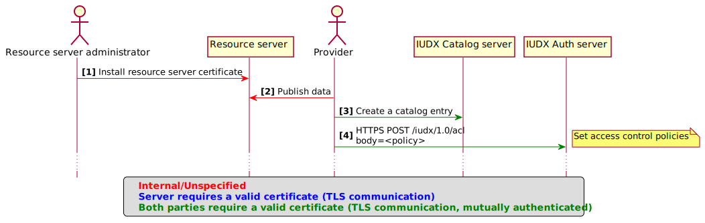
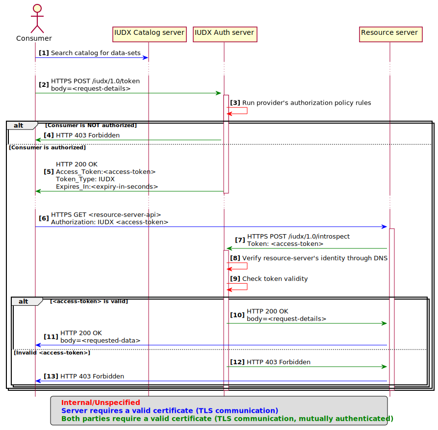

Authentication, Authorization, and Accounting (AAA) in IUDX
=

# 1. Certificate classes

The AAA of IUDX relies heavily on digital ceriticates. The IUDX-CA (https://ca.iudx.org.in) is an email based CA which issues the following classe of certificates:

* `Class-1` is for resource servers
* `Class-2` is expected to be issued to consumers requesting for protected data
* `Class-3` is for managing entries in the catalog
* `Class-4` is expected to be issued to consumers requesting for protected and private data
* `Class-5` is expected to be issued to consumers requesting for protected, private, and confidential data

Classes indicate the trust and the expected use of the certificate. The IUDX-CA, IUDX-Auth server, and IUDX-Catalog use the class information to determine what actions are allowed when using a certificate.

However, when a consumer uses his/her certificate to request for data, it is up to the provider to use the class information as they see fit.

> The class information is merely a `tag` indicating the trust an organization/CA places on the user of the certificate. 
> A provider `may` choose to ignore this field while writing the authorization rules.

> If a provider would like to write authorization rules based on the certificate classes, please make sure that the provider trusts the consumer's organization first. And use the certificate class as an additional `AND` condition rather than using it as the only condition.

# 2 Getting certificates

IUDX-CA will only process emails from a white-listed domains; hence the first step would be to manually contact IUDX-CA to white-list a domain.

## 2.1 For resource servers (class-1)
Certificates can be obtained by sending an email:

* **To:** **ca@iudx.org.in**
* **Subject:** Certificate request RS `<fully qualified domain name>`
* **Attachment:** The certificate signing request (CSR) in .pem format

## 2.2 For individuals (class-2)

Certificates can be obtained by sending an email:

* **To:** **ca@iudx.org.in**
* **Subject:** Certificate request
* **Attachment:** The certificate signing request (CSR) in .pem format

## 2.3 For data officers (class-3)

Certificates can be obtained by sending an email:

* **From:** An email id begining with **data.officer.`*`** **@organization-domain**
* **From example:** **data.officer.pune@organization-domain**
* **To:** **ca@iudx.org.in**
* **Subject:** Certificate request
* **Attachment:** The certificate signing request (CSR) in .pem format

## 2.4 For organizations to act as IUDX sub-CA

Certificates can be obtained by sending an email:

* **From:** **iudx.sub.ca@organization-domain**
* **To:** **ca@iudx.org.in**
* **Subject:** Certificate request
* **Attachment:** The certificate signing request (CSR) in .pem format

Using the received certificate, the sub-CA can issue certificates to their employees without depending on IUDX-CA. The sub-CA should only issue certificates to their employees; and the email domain of the sub-CA and employees email domain must match. For example: iudx.sub.ca@iisc.ac.in can only issue certificates to employees whose emails end with @iisc.ac.in. There is no restriction on the class of certificates a sub-CA can issue.

> The tools/scripts required to run a sub-CA will be provided by the IUDX-CA.

## 2.5 For resource-servers of an organization (class-1)

Certificates can be obtained by sending an email:

* **To:** **iudx.sub.ca@organization.domain**
* **Subject:** Certificate request RS `<fully qualified domain name>`
* **Attachment:** The certificate signing request (CSR) in .pem format

> These certificates are issued by the sub-CA running at the employees organization.


## 2.5 For employees of an organization (class-2 to class-5)

Certificates can be obtained by sending an email:

* **To:** **iudx.sub.ca@organization.domain**
* **Subject:** Certificate request
* **Attachment:** The certificate signing request (CSR) in .pem format

> These certificates are issued by the sub-CA running at the employees organization.


## 2.6 For individuals (class-1 to class-5)

Individuals whose email domain is not white-listed and are not associated with any organization, but would like to participate in IUDX activities may do so by manually contacting IUDX.
IUDX administrator will make a decision on case-by-case basis.


# 3 Flow

## 3.1 Setup


## 3.2 Data request


# 4 Authorization rules

Providers delegate authorization to IUDX-Auth server in the form of rules. These rules are run each time a consumer requests for data access. As IUDX-Auth server simply executes the rules, it is the responsibility of the provider to set correct rules. Ideally, the rules must match the provider's data sharing policy, should go through a review process, be vetted by concerned parties, and tested before applying.

The rules are based on aperture policy language [https://github.com/joyent/node-aperture]
and has the following structure:

```sh
<consumer(s)> CAN access <resource-id(s)> FOR <n> <second(s)/minute(s)/week(s)/month(s)/year(s)> IF <condition> AND/OR <more-conditions>
```

**Example-1:**

__Intent:__

A user arun at IISc can read a resource called "malleshwaram.streetlights.SL1" whose data is served through a resource server "bangalore.smartcity.com", using API endpoint `/latest`, unconditionally.

__Rule:__

`barun@iisc.ac.in can access bangalore.smartcity.com/malleshwaram.streetlights.SL1/latest for 2 hours if api = "/latest" AND method = "POST"`

**Example-2:**

__Intent:__

Users arun and poorna at IISc can read, write, and control all street lights in malleshwaram whose resource server is "bangalore.smartcity.com", between 6 pm and 12 midnight.

__Rule:__

`barun@iisc.ac.in, poorna@iisc.ac.in can access bangalore.smartcity.com/malleshwaram.streetlights.*/* if time > 18:00:00 and time < 24:00:00`

**Example-3:**

__Intent:__

Public data can be read by anyone by using the `/latest` endpoint if requested within India

__Rule:__

`all can access bangalore.smartcity.com/public.* if api = '/latest' AND country = "IN"`

Aperture also supports rules like:

* `ip = 10.0.0.1`
* `cert.cn like  /* at IISc/i`
* `latitude > 20.03 AND longitude > 40.22`
* `time::day in (Monday, Tuesday, Wednesday, Thursday, Friday)`

You may use a single `*`, or `all`, `everything`, or `anything` to match any identifier; example:

   * `barun@iisc.ac.in can access *`
   * `All can access anything`

Several rules could be combined together using semi-colons:

`rule-1; rule-2;  .... ; rule-n`

> The structure of resource name is left up to the provider. Well structured resource name makes writing rules easier.

The list of variables available in rules are:

|Variable | Type  |  Meaning |
|---|---|---|
|`time`| time | the time at which the data request was made|
|`ip`|ip|The originating ip address of the request|
|`tokens_per_day`|number|The total number of tokens issued today to the consumer for the given resource |
||
|`cert.cn`|string| The CN of consumer's certificate |
|`cert.class`| string| The class of consumer's certificate |
| `cert.o` | string|The organization name given in the certificate|
| `cert.ou` | string|The organization unit given in the certificate|
| `cert.c ` |string|The country code given in the certificate|
| `cert.st` |string|The state name given in the certificate|
| `cert.gn` |string|The given name field of the certificate|
| `cert.sn` |string|The surname field of the certificate |
| `cert.title` |string|The role/title of employee in the organization |
||
| `cert.issuer.cn` | string|The CN of the certificate CA/sub-CA|
| `cert.issuer.email` | string|The email address of the CA/sub-CA|
| `cert.issuer.o` |string|The organization of the CA/sub-CA|
| `cert.issuer.ou` |string|The organization unit of the CA/sub-CA|
| `cert.issuer.c` |string|The country code of the CA/sub-CA|
| `cert.issuer.st` |string|The state of the CA/sub-CA|
||
| `country` |string|The consumer's country code from where the request for data originated|
| `region ` |string|The consumer's region from where the request for data originated|
| `timezone` |string|The consumer's timezone from where the request for data originated|
| `city` |string|The consumer's city from where the request for data originated|
| `latitude` |number|The consumer's latitude from where the request for data originated|
| `longitude` |number|The consumer's longitude from where the request for data originated|
||
| `body.*` |string| The variables to be passed in the body of an API |


## 2. APIs

The API documentation is available [here](doc.html) and the swagger.json can be found [here](swagger.json).
